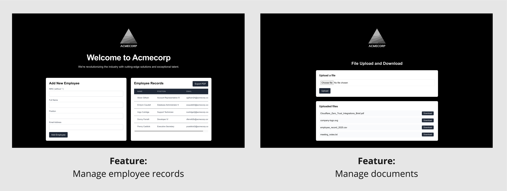

# acmecorp-corpapp 🏢💻

`acmecorp-corpapp` 🏢💻 – A web app with a pre-seeded employee database, allowing you to add, view, and manage employee records and documents. Ideal for testing, demos, and development! 



Routes and their respective features:

* `<baseUr>/`: Manage employee records
* `<baseUr>/updown`: Manage documents

The architectural diagram for the setup:


## How to use

Head straight to this doc: [Run containers on host](./docs/run_containers_on_host.md).

## How to customize

> [!note]
> This section is for you if you would like to customize your own `acmecorp-corpapp` web app. For instance, using different logo et cetera.

This project has the following structure:

```bash
.
├── README.md
├── acmecorp-app
├── docker-compose.local.yml
├── docker-compose.yml
├── docs
├── nginx 
└── postgres 
```

- `acmecorp-app` - Personalize your web app by adding features or updating the logo, with the option to publish it as an image.
- `nginx-acmecorp` - Customize Nginx configurations to fit your needs, and publish if needed.
- `postgres` - Contains PostgreSQL-related scripts for database setup and management.