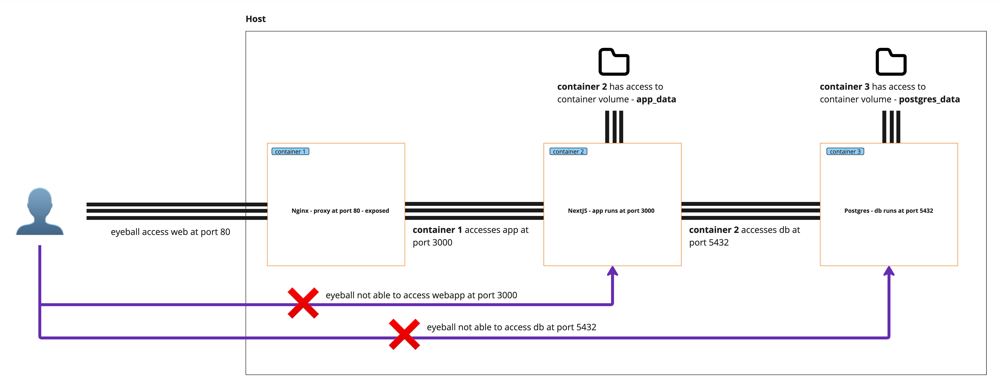

# acmecorp-backend

This project contains the following:

```bash
.
├── README.md
├── acmecorp-app (folder to build image: nextjs-acmecorp)
├── docker-compose.yml
├── docs
├── nginx (folder to build image: nginx-acmecorp) 
└── postgres 
```

- `nextjs-acmecorp` - Image for NextJS fullstack app container
- `nginx-acmecorp` - Image for Nginx proxy
- `postgres` - Image for Postgres database 

# Run containers

Refer [Run containers on host](./docs/run_containers_on_host.md).

Here's the architectural diagram of the setup used:


